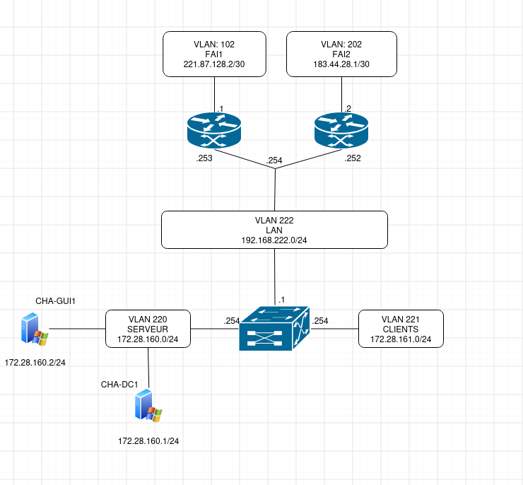

# Annexes
Ici vous allez trouvez toute les annexes

## Shéma Logique

Ceci est le schéma logique du réseau

## Plan d'adressage IP

| Nom | Vlan | IP |
|:---:|:----:|:--:|
| Management | 120 | 10.28.2.0/28 |
| Serveur | 220 | 172.28.220.0/24 |
| Clients | 221 | 172.28.221.0/24 |
| LAN | 222 | 172.28.222.0/24 |