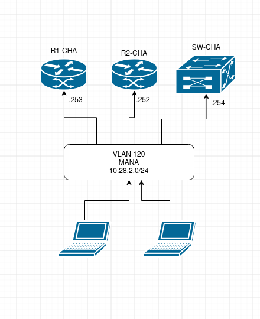

# Annexes
Toutes les annexes réunit sur cette page

## Schéma Logique

 

## Schéma Mana

 
 
## Plage IP Site

|          | Reseau       | Broadcast      |
|----------|--------------|----------------|
| Chartres | 172.28.160.0 | 172.28.191.255 |
| Bourges  | 172.28.192.0 | 172.28.223.255 |
| Tours    | 172.28.64.0  | 172.28.127.255 |
| Orleans  | 172.28.128.0 | 172.28.159.255 |
| Blois    | 172.28.32.0  | 172.28.63.255  |

 
## Plan d'adressage IP

| Nom | Vlan | IP |
|:---:|:----:|:--:|
| MANA | 120 | 10.28.2.0/28 |
| SERVEUR | 220 | 172.28.220.0/24 |
| CLIENT | 221 | 172.28.221.0/24 |
| LAN | 222 | 192.168.222.0/24 |

 
## Plan De Brassage

| SW-Chartres | Ports | VLAN |
|:-:|:-:|:-:|
| R1-CHA | Gig0/1 | Trunk |
| R2-CHA | Gig0/2 | Trunk |
| | Gig0/3 | |
| | Gig0/4 | |
| | Gig0/5 | |
| | Gig0/6 | LAN |
| | Gig0/7 | |
| | Gig0/8 | LAN |
| | Gig0/9 | SERVEUR |
| | Gig0/10 | SERVEUR|
| | Gig0/11 | CLIENT |
| | Gig0/12 | CLIENT |
| | Gig0/13 | CLIENT |
| | Gig0/14 | |
| | Gig0/15 | |
| | Gig0/16 | |
| | Gig0/17 | |
| | Gig0/18 | |
| | Gig0/19 | |
| | Gig0/20 | Serveur |
| | Gig0/21 | |
| | Gig0/22 | LAN |
| | Gig0/23 | MANA |
| | Gig0/24 | MANA |
| | Gi0/1 | |
| | Gi0/2 | |
